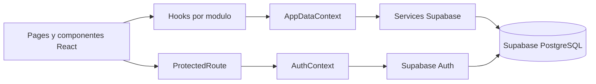

# FinanzasU

Aplicacion web para gestionar finanzas personales de estudiantes, construida con React + Vite y Supabase.

## Estado de Historias de Usuario (Checklist)

Actualizado: 2026-04-20

- [x] HU-01 - Disponibilidad y coherencia de mi informacion
- [x] HU-02 - Sesion estable y control de acceso
- [x] HU-03 - Mensajes de conflicto claros
- [x] HU-04 - Perfil y credenciales seguras
- [x] HU-05 - Paginas de acceso claras y accesibles
- [x] HU-06 - Navegacion y perfil faciles de usar
- [x] HU-07 - Gestion de transacciones y categorias
- [x] HU-08 - Gestion de presupuestos y vista responsive
- [x] HU-09 - Dashboard financiero y visualizacion de datos
- [ ] HU-10 - Pendiente
- [ ] HU-11 - Pendiente
- [ ] HU-12 - Pendiente
- [x] HU-13 - Sistema de notificaciones con campana, RLS y eventos automaticos

Nota de estado:
- HU-01 a HU-09 estan implementadas e integradas.
- HU-13 esta implementada en la rama HU-13.
- HU-10, HU-11 y HU-12 quedan pendientes para siguientes iteraciones.

## Tecnologias

- React
- Vite
- React Router
- Supabase JS
- react-hot-toast
- lucide-react
- recharts
- Tailwind CSS

## Estructura real del proyecto

```text
FinanzasU/
  src/
    components/
      charts/
      layout/
        Layout.jsx
        Navbar.jsx
        ProtectedRoute.jsx
      ui/
        Modal.jsx
        Spinner.jsx
    context/
      AuthContext.jsx
      AppDataContext.jsx
    hooks/
      useAuth.js
      useInitialData.js
      useCategorias.js
      useTransacciones.js
      usePresupuestos.js
    pages/
      Login.jsx
      Register.jsx
      Dashboard.jsx
      Transacciones.jsx
      Categorias.jsx
      Presupuestos.jsx
      Perfil.jsx
    services/
      supabaseClient.js
      categoriasService.js
      transaccionesService.js
      presupuestosService.js
    utils/
      constants.js
      formatMoneda.js
      validationHelpers.js
  supabase/
    migrations/
      001_initial_schema.sql
    policies.sql
    seed.sql
  docs/
    diagrama-er.md
```

## Diagrama de arquitectura del proyecto



## Evidencias de cumplimiento por HU

### HU-01 - Disponibilidad y coherencia

- [x] Carga inicial por contexto y hooks
- [x] Servicios por modulo sin consultas directas desde pages
- [x] Totales en dashboard reflejan nuevas transacciones
- [x] Manejo de error global sin corromper estado cargado

### HU-02 - Sesion estable y control de acceso

- [x] Sesion persistente al recargar (getSession + onAuthStateChange)
- [x] Redireccion a login cuando no hay sesion valida
- [x] Logout con limpieza de estado sensible
- [x] Navegacion con replace para evitar regreso a vistas privadas

### HU-03 a HU-08 - Avances en develop

- [x] HU-03: mensajes claros en conflictos de autenticacion
- [x] HU-04: actualizacion de perfil y contrasena
- [x] HU-05: experiencia de acceso mas clara/accesible
- [x] HU-06: layout con sidebar y navegacion consolidada
- [x] HU-07: CRUD de transacciones/categorias + validaciones
- [x] HU-08: CRUD de presupuestos + resumen por estado

## Trazabilidad HU -> Archivos clave

| HU | Archivos |
|---|---|
| HU-01 | src/context/AppDataContext.jsx, src/hooks/useInitialData.js, src/hooks/useCategorias.js, src/hooks/useTransacciones.js, src/hooks/usePresupuestos.js, src/services/categoriasService.js, src/services/transaccionesService.js, src/services/presupuestosService.js, src/pages/Dashboard.jsx, src/pages/Transacciones.jsx, supabase/migrations/001_initial_schema.sql, supabase/policies.sql, supabase/seed.sql |
| HU-02 | src/context/AuthContext.jsx, src/hooks/useAuth.js, src/components/layout/ProtectedRoute.jsx, src/pages/Login.jsx, src/pages/Register.jsx, src/pages/Dashboard.jsx, src/services/supabaseClient.js |
| HU-03 | src/pages/Login.jsx, src/pages/Register.jsx, src/context/AuthContext.jsx |
| HU-04 | src/pages/Perfil.jsx, src/hooks/useAuth.js, src/context/AuthContext.jsx, src/utils/constants.js |
| HU-05 | src/pages/Login.jsx, src/pages/Register.jsx, src/auth-theme.css |
| HU-06 | src/components/layout/Layout.jsx, src/components/layout/Navbar.jsx, src/pages/Perfil.jsx, src/App.jsx |
| HU-07 | src/pages/Transacciones.jsx, src/pages/Categorias.jsx, src/hooks/useTransacciones.js, src/hooks/useCategorias.js, src/services/transaccionesService.js, src/services/categoriasService.js, src/utils/validationHelpers.js |
| HU-08 | src/pages/Presupuestos.jsx, src/hooks/usePresupuestos.js, src/services/presupuestosService.js, src/utils/formatMoneda.js, src/utils/constants.js |

## Diagrama ER de base de datos

Documento recomendado para presentacion tecnica del modelo de datos:

- docs/diagrama-er.md

## Documentacion HU1 y HU2

Carpeta sugerida para identificar rapidamente la documentacion de las HU iniciales:

- docs/HU1-HU2/01-documentacion-funcional.md
- docs/HU1-HU2/02-documentacion-tecnica.md
- docs/HU1-HU2/03-trazabilidad-hu1-hu2.md

## Plantilla de actualizacion de estado (por sprint)

Usar esta plantilla en cada cierre de sprint para mantener el checklist vivo:

```md
### Sprint X - Fecha: YYYY-MM-DD

- HU-XX: [ ] pendiente / [x] cumplida
  - Criterio 1: [ ]/[x]
  - Criterio 2: [ ]/[x]
  - Evidencia: enlace PR / commit / captura

- Riesgos detectados:
  - ...

- Proximo enfoque:
  - ...
```

## Configuracion local

### 1) Instalar dependencias

```bash
npm install
```

### 2) Variables de entorno

Crear o completar el archivo .env.local en la raiz del proyecto con:

```env
VITE_SUPABASE_URL=https://TU-PROYECTO.supabase.co
VITE_SUPABASE_ANON_KEY=TU_ANON_KEY
```

Si faltan estas variables, la app lanza error controlado desde src/services/supabaseClient.js.

### 3) Inicializar base de datos (Supabase SQL Editor)

Ejecutar en este orden:

1. supabase/migrations/001_initial_schema.sql
2. supabase/migrations/002_notifications.sql
3. supabase/policies.sql
4. supabase/seed.sql

### 4) Levantar la aplicacion

```bash
npm run dev
```

URL local por defecto: http://localhost:5173

## Scripts disponibles

- npm run dev
- npm run build
- npm run lint
- npm run preview

## Estado tecnico actual

- Rama de trabajo actual: HU-13
- HU-01 a HU-09: integradas
- HU-13: implementada y subida en HU-13 (lista para PR a develop)
- HU-10 a HU-12: pendientes
