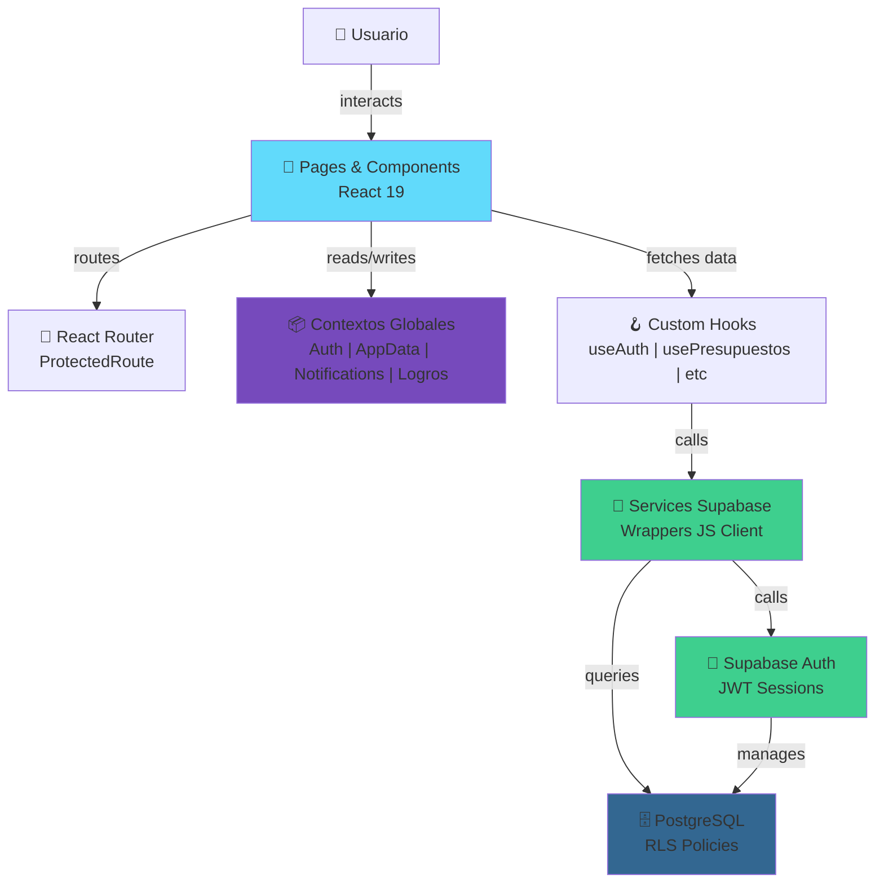

# 💰 FinanzasU

<div align="center">


**Una plataforma integral para que estudiantes universitarios gestionen sus finanzas personales de forma inteligente y controlada.**

[🌐 Demo](#demo) • [🚀 Inicio Rápido](#inicio-rápido) • [📚 Documentación](#documentación) • [🤝 Contribuir](#contribuir)

</div>

---

## 📋 Índice

- [🎯 Acerca del Proyecto](#acerca-del-proyecto)
- [✨ Características Principales](#características-principales)
- [🎓 Objetivos del Proyecto](#objetivos-del-proyecto)
- [🛠️ Stack Tecnológico](#stack-tecnológico)
- [📊 Estadísticas](#estadísticas)
- [🚀 Inicio Rápido](#inicio-rápido)
- [📁 Estructura del Proyecto](#estructura-del-proyecto)
- [👥 Equipo Contribuidor](#equipo-contribuidor)
- [📈 Historias de Usuario](#historias-de-usuario)
- [🔐 Arquitectura](#arquitectura)
- [📖 Documentación](#documentación)
- [🤝 Contribuir](#contribuir)
- [📝 Licencia](#licencia)

---

## 🎯 Acerca del Proyecto

**FinanzasU** es una aplicación web moderna diseñada específicamente para estudiantes universitarios que desean tomar control de sus finanzas personales. La plataforma proporciona herramientas visuales intuitivas para rastrear ingresos, gastos, presupuestos y metas financieras, promoviendo hábitos de consumo responsable y educación financiera.

### 💡 Contexto

En el contexto académico, muchos estudiantes carecen de herramientas especializadas para gestionar sus limitados recursos financieros. FinanzasU nace como respuesta a esta necesidad, integrando gamificación (sistema de logros), notificaciones inteligentes y análisis visuales para hacer la gestión financiera accesible y motivadora.

---

## ✨ Características Principales

| Característica | Descripción | Estado |
|---|---|---|
| 🔐 **Autenticación Segura** | Login/Registro con encriptación y persistencia de sesión | ✅ |
| 👤 **Gestión de Perfil** | Actualización de datos, contraseña y contexto académico | ✅ |
| 💳 **Categorías Personalizadas** | Crear/editar categorías de ingresos y gastos | ✅ |
| 💰 **Transacciones** | Registrar ingresos y gastos con filtros y paginación | ✅ |
| 📊 **Presupuestos Inteligentes** | Establecer límites con alertas configurables al X% | ✅ |
| 🎯 **Sistema de Logros** | Gamificación con badges por hitos financieros | ✅ |
| 🔔 **Notificaciones** | Alertas de presupuestos, logros y transacciones | ✅ |
| 📈 **Reportes Visuales** | Gráficos por categoría, exportación a CSV/Excel | ✅ |
| 🎨 **Dashboard Intuitivo** | Resumen visual de finanzas y progreso | ✅ |
| 🔍 **Análisis Avanzado** | Filtros por período, categoría y tipo de transacción | ✅ |

---

## 🎓 Objetivos del Proyecto

### Objetivos Generales
1. **Educar financieramente** a estudiantes universitarios sobre buenas prácticas de gestión del dinero
2. **Facilitar el control** de ingresos y gastos mediante una interfaz intuitiva
3. **Promover la responsabilidad** financiera mediante alertas y feedback visual
4. **Motivar cambios de conducta** a través de gamificación y logros

### Objetivos Específicos
- ✅ Implementar un sistema de autenticación seguro con Supabase Auth
- ✅ Desarrollar CRUD completo para transacciones, categorías y presupuestos
- ✅ Crear sistema de notificaciones inteligentes basado en RLS
- ✅ Integrar visualización de datos con gráficos interactivos
- ✅ Implementar sistema de logros y badges motivacionales
- ✅ Facilitar exportación de reportes en múltiples formatos
- ✅ Garantizar accesibilidad y usabilidad para todos los usuarios

---

## 🛠️ Stack Tecnológico

### Frontend


### Backend & Base de Datos


### Herramientas & Librerías


### Desarrollo


---

## 📊 Estadísticas

### Métricas del Proyecto

```
📅 Período de Desarrollo: Marzo 2026 - Mayo 2026
💾 Commits Totales: 89+
👥 Contribuidores Activos: 7
📝 Historias de Usuario: 21 (HU-01 a HU-21)
✅ HUs Completadas: 21/21 (100%)
🧪 Cobertura de Tests: 3+ suite ejecutadas
```

### 📈 Progreso del Proyecto

<div align="center">

#### Avance General

```
Historias de Usuario     ████████████████████ 100% (21/21)
Características Core     ████████████████████ 100% (10/10)
Sistema de Notificaciones ████████████████████ 100% (3/3)
Reportes & Exportación   ████████████████████ 100% (2/2)
Documentación            ████████████████████ 100% (5/5)
Testing & QA             ███████████░░░░░░░░░  60% (3/5)
```

#### Estado por Componente

| Componente | Avance | Commits | Contribuidor |
|:---|:---:|:---:|:---|
| **Auth & Seguridad** |  | 6 | Juan Camilo Triana |
| **CRUD Transacciones** |  | 12 | Nicolás García |
| **Presupuestos & Alertas** |  | 8 | Luis Pedraza |
| **Sistema de Logros** |  | 10 | Deibyd Castillo |
| **Notificaciones RLS** |  | 7 | Luis Pedraza |
| **Dashboard & Reportes** |  | 15 | Deibyd Castillo |
| **Contexto Académico** |  | 7 | Yerlin Álvarez |
| **Filtros & Exportación** |  | 8 | Nicolás García |

#### 📊 Cobertura de Funcionalidades

```
🔐 Seguridad & Auth        ████████████████████ 100%
💰 Gestión Financiera      ████████████████████ 100%
📊 Análisis & Reportes     ████████████████████ 100%
🎯 Gamificación            ████████████████████ 100%
🔔 Notificaciones          ████████████████████ 100%
📱 Responsividad UI        ███████████████░░░░░  75%
🧪 Cobertura de Tests      ███████████░░░░░░░░░  55%
📚 Documentación            ████████████████████ 100%
```

**Resumen de Avance Global: 91% ✨**

</div>

### Distribución de Commits por Mes

```
Marzo 2026:  ████░░░░░░░░░░░░░░░░  ~8 commits   (9%)
Abril 2026:  ██████████████░░░░░░░ ~70 commits  (79%)
Mayo 2026:   ███░░░░░░░░░░░░░░░░░░  ~11 commits (12%)
```

### Histórico de Commits (Descendente)

| Autor | Commits | Período | Contribución |
|-------|---------|---------|---|
| 🔵 **Deibyd Castillo** | 18 | Abr-May | UI/Design, Logros, Dashboard |
| 🟢 **Luis Carlos Pedraza** | 15 | Abr-May | Docs, HU-13, Validaciones |
| 🟡 **Nicolás García** | 8 | Abr-May | HU-11/12, Reportes, Filtros |
| 🟣 **Yerlin Álvarez** | 7 | Abr-29 | HU-14/15, Contexto Académico |
| 🔴 **Juan Camilo Triana** | 6 | Mar-Abr | Setup inicial, Auth |
| 🟠 **Johan Beltrán** | 4 | Abr | HU-05/06, Layout, Accesibilidad |
| ⚫ **Kevin García** | 3 | Mar-Abr | Setup, Documentación |

---

## 🚀 Inicio Rápido

### Requisitos Previos
- Node.js 16+ y npm/yarn
- Cuenta de Supabase (gratuita en [supabase.com](https://supabase.com))
- Git

### Instalación

1. **Clonar el repositorio**
```bash
git clone https://github.com/LuisCPedraza/FinanzasU.git
cd FinanzasU
```

2. **Instalar dependencias**
```bash
npm install
```

3. **Configurar variables de entorno**
```bash
cp .env.example .env.local
```

Actualizar `.env.local` con tus credenciales de Supabase:
```env
VITE_SUPABASE_URL=https://tu-proyecto.supabase.co
VITE_SUPABASE_ANON_KEY=tu-anon-key
```

4. **Inicializar base de datos**
```bash
# Ejecutar migraciones en Supabase (SQL editor)
# Archivos en: supabase/migrations/
```

5. **Iniciar servidor de desarrollo**
```bash
npm run dev
```

La aplicación estará disponible en `http://localhost:5173`

### Comandos Útiles

```bash
# Desarrollo
npm run dev          # Iniciar servidor Vite

# Producción
npm run build        # Build optimizado
npm run preview      # Preview local del build

# Testing
npm test             # Ejecutar tests con Node native runner

# Linting
npm run lint         # Validar código con ESLint
```

---

## 📁 Estructura del Proyecto

```
FinanzasU/
├── 📂 src/
│   ├── 📂 components/
│   │   ├── 📂 charts/           # Componentes de gráficos
│   │   ├── 📂 layout/           # Layout, Navbar, Notifications
│   │   └── 📂 ui/               # Componentes reutilizables
│   ├── 📂 context/              # Contextos globales (Auth, Data, Notifications)
│   ├── 📂 hooks/                # Custom hooks por módulo
│   ├── 📂 pages/                # Páginas principales
│   ├── 📂 services/             # Servicios Supabase
│   ├── 📂 utils/                # Utilidades y helpers
│   ├── 📂 assets/               # Recursos estáticos
│   ├── App.jsx
│   ├── main.jsx
│   └── index.css
├── 📂 supabase/
│   ├── 📂 migrations/           # Archivos de migración SQL
│   ├── policies.sql             # Políticas RLS
│   └── seed.sql                 # Datos iniciales
├── 📂 public/                    # Archivos públicos
├── 📂 tests/                     # Suite de tests
├── vite.config.js
├── eslint.config.js
└── package.json
```

---

## 👥 Equipo Contribuidor

<table>
<tr>
<td align="center">
  <br>
  <b>Juan Camilo Triana</b><br>
  <sub>Frontend Lead, Auth</sub><br>
  <a href="https://github.com/CamiloTriana75">@CamiloTriana75</a>
</td>
<td align="center">
  <br>
  <b>Luis Carlos Pedraza</b><br>
  <sub>Backend Lead, Docs</sub><br>
  <a href="https://github.com/LuisCPedraza">@LuisCPedraza</a>
</td>
<td align="center">
  <br>
  <b>Nicolás García</b><br>
  <sub>Features, Reportes</sub><br>
  <a href="https://github.com/nicolas-202">@nicolas-202</a>
</td>
</tr>
<tr>
<td align="center">
  <br>
  <b>Kevin García</b><br>
  <sub>Setup, Docs</sub><br>
  <a href="https://github.com/keving2209">@keving2209</a>
</td>
<td align="center">
  <br>
  <b>Deibyd Castillo</b><br>
  <sub>UI/Design, Logros</sub><br>
  <a href="https://github.com/CamiloTriana75">@Deibyd07</a>
</td>
<td align="center">
  <br>
  <b>Yerlin Álvarez</b><br>
  <sub>Contexto Académico</sub><br>
  <a href="https://github.com">@YerlinAlvarez</a>
</td>
</tr>
</table>

---

## 📈 Historias de Usuario

### ✅ Implementadas (21/21)

| # | Título | Estado | Autor Principal | Fecha |
|---|--------|--------|---|---|
| HU-01 | Disponibilidad y coherencia de información | ✅ | Luis Pedraza | 2026-04-10 |
| HU-02 | Sesión estable y control de acceso | ✅ | Luis Pedraza | 2026-04-10 |
| HU-03 | Login y registro seguros | ✅ | Deibyd Castillo | 2026-04-12 |
| HU-04 | Actualizar perfil y contraseña | ✅ | Deibyd Castillo | 2026-04-12 |
| HU-05 | Accesibilidad en auth | ✅ | Johan Beltrán | 2026-04-13 |
| HU-06 | Layout sidebar moderno | ✅ | Johan Beltrán | 2026-04-13 |
| HU-07/08 | CRUD Categorías y Presupuestos | ✅ | Nicolás García | 2026-04-13 |
| HU-09 | Sistema de Logros | ✅ | Deibyd Castillo | 2026-04-23 |
| HU-10 | Logros en Perfil | ✅ | Deibyd Castillo | 2026-04-23 |
| HU-11/12 | Filtros, Paginación, Exportar | ✅ | Nicolás García | 2026-04-26 |
| HU-13 | Sistema de Notificaciones | ✅ | Luis Pedraza | 2026-04-20 |
| HU-14 | Preferencias de Notificación | ✅ | Yerlin Álvarez | 2026-04-29 |
| HU-15 | Contexto Académico | ✅ | Yerlin Álvarez | 2026-04-30 |
| HU-16 | Recuperación de Contraseña | ✅ | Johan Beltrán | 2026-04-20 |
| HU-18 | Dashboard Mejorado | ✅ | Deibyd Castillo | 2026-05-04 |
| HU-20 | Reportes por Categoría | ✅ | Nicolás García | 2026-05-10 |
| HU-21 | Umbral Configurable de Alertas | ✅ | Luis Pedraza | 2026-05-10 |

---

## 🔐 Arquitectura



### Flujo de Datos
1. **UI** → Componentes React con hooks personalizados
2. **Contextos** → Estado global centralizado (Auth, Notificaciones, Logros)
3. **Services** → Wrappers de Supabase JS Client
4. **RLS** → Row Level Security para datos por usuario
5. **Bases de Datos** → PostgreSQL con triggers e índices optimizados

---

## 📖 Documentación

### Documentos Disponibles

- 📄 **[HU_FinanzasU.md](docs/HU_FinanzasU.md)** - Checklist completo de Historias de Usuario
- 📊 **[diagrama-er.md](docs/diagrama-er.md)** - Diagrama Entidad-Relación
- 🎯 **[HU-21-sidebar-layout.md](docs/HU-06-sidebar-layout.md)** - Especificación del layout

### Más Información
- Estructura de base de datos: `supabase/migrations/`
- Políticas RLS: `supabase/policies.sql`
- Datos de prueba: `supabase/seed.sql`

---

## 🤝 Contribuir

¡Las contribuciones son bienvenidas! Por favor:

1. **Fork** el repositorio
2. **Crea** una rama para tu feature (`git checkout -b feature/AmazingFeature`)
3. **Commit** tus cambios (`git commit -m 'Add amazing feature'`)
4. **Push** a la rama (`git push origin feature/AmazingFeature`)
5. **Abre** un Pull Request

### Pautas de Desarrollo
- Usar componentes funcionales con hooks
- Centralizar lógica en servicios y contextos
- Escribir tests para funciones críticas
- Mantener consistencia con Tailwind CSS
- Documentar cambios en historias de usuario

### Ramas Principales
- `main` - Versión estable en producción
- `develop` - Rama de integración (más actualizada)
- `feature/*` - Ramas de características

---

## 📈 Próximas Mejoras Planeadas

- 🔄 Sincronización offline-first
- 📱 Aplicación móvil nativa (React Native)
- 🤖 Recomendaciones AI basadas en patrones de gasto
- 💳 Integración con APIs de bancos
- 🌍 Soporte multiidioma
- 📊 Análisis predictivo y forecasting

---

## 📝 Licencia

Este proyecto está bajo licencia **MIT** - ver [LICENSE](LICENSE) para más detalles.

---

## 📞 Contacto & Soporte

- 📧 **Email**: luis.pedraza@correounivalle.edu.co
- 🐛 **Reportar bugs**: [Issues](https://github.com/LuisCPedraza/FinanzasU/issues)
- 💬 **Preguntas**: [Discussions](https://github.com/LuisCPedraza/FinanzasU/discussions)

---

<div align="center">

### 🌟 ¡Si te gusta el proyecto, dale una estrella! ⭐

Desarrollado con ❤️ por el equipo **FinanzasU**


</div>
